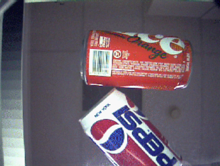
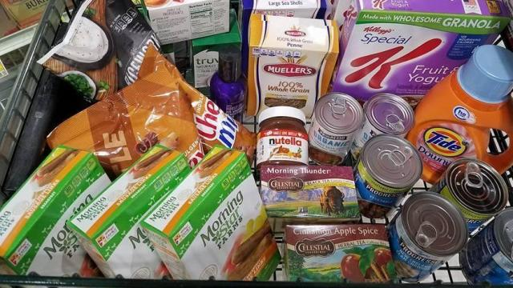
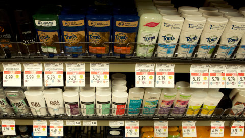

# product-recognition
Author: Sérgio Ricardo G. B. Filho
NUSP: 10408386

The goal of this project is to recognize grocery stores products in images. To do so image enhancement techniques will be used to improve the images quality as well as image segmentation techniques to crop the products out of the backgroud before detection (if applied).

Below are 3 possible approachs of what kinds of images to use: individual products, products in cart and products in shelves.

  
  
  

