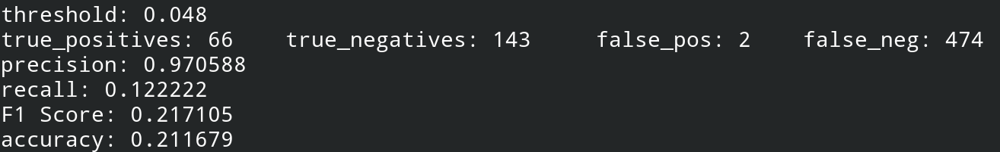

# product-recognition
Author: Sérgio Ricardo G. B. Filho  
NUSP: 10408386

### Project Goal
---------
The goal of this project is to recognize supermarket products in images or, more specifically, every product of a supermarket as individual products in images of the checkout conveyor belt. The model created will be able to generate representations for new products(not present in the training base) in order to recognize them. The idea is that after an unknown product appears a labeled representation is stored and when this product appears for the fourth time the program will be able to recognize it using only the three previous representations.  
  
### Input Images
---------
The images were provided by the gryfo company.  
Each image contains a close up of a single product in a specific orientation. That way each product can be represented by a set of images showing different faces and rotations. See the example below for cherry gelatin.

  
  
  
  

  

### Steps
---------
In order to achieve the goal a computer vision approach for feature descriptions extraction was used.  
Before extracting the features a preprocessing step is performed to improve the contrast in the image. For this step, a clahe filter is applied.

  
  

Notice that the use of clahe added more noise to the image so, to avoid extracting noise as features later on(example below), a denoise step is required.

  
  

To perform the feature extraction step the ORB algorithm was chosen as it has proven to be as efficient as SIFT but faster and free for commercial use. Below are the results for the cherry gelatin example. In the image on the left without preprocessing 796 features were extracted whereas in the image on the right, after the preprocessing steps, 1119 features were extracted.	

  
  

  
 
The bag of features technique was used for the recognition of the products. Tests were made using both the classic model and models combined with ML approaches.
So, after the features were extracted, a k-means clustering was applyed to give the dictionary of visual words. With that in hands, a normalized histogram of visual words(descriptors) was obtained for each image in the training base.
ADD SAMPLE IMAGE
Three different methods were used to recognize products:
<ul>
<li>Computing the histogram for the query image and retrieving the product with most similar(closest) histogram as result.</li>
<li>Using Random Forest method trained with the images descriptors histograms to create a model for classification.</li>
<li>Same as above, but using Linear SVM method.</li>
</ul>
 

### Results
---------
In an attempt to test the response of features obtained with ORB after the object is rotated, a Brute Force method was used to compare the different images of the product and match the 30 most similar features. Notice that the greater the rotation of the image, the greater the number of wrong matches.

  
  
  
  

  
For the purpose of understanding the results of this implementation, it is necessary to make the definitions below:
<ul>
  <li>A <strong>True positive</strong> is when a product is correctly recognized</li>
<li>A <strong>True negative</strong> is when an unknown product(not present in the training base) is correctly appointed by the program as unknown</li>
  <li>A <strong>False positive</strong> is when the program mistakenly recognizes the product</li>
<li>A <strong>False negative</strong> is when the query product is appointed to be unknown while the program was actually trained to recognize it</li>
</ul>
 

For these first results, the train and test bases were created so that the test base only had images of products that appeared in the training base(different pictures of same products). In other words, the only possible results were **True positives** or **False positives**.
The measurements of **recall** were taken for each one of the three methods. The values would go up a little for smaller training bases(less number of different products) but overall, as seen below, were very low.

  
  
  

For the second round of tests, a percentage of unknown products was added to the test base. The ML methods were not tested nor here nor in the next round of tests( as it was desired to feed the products detected as unknown back to the model, the ML methods used would require a new training every time a product was indicated as unknown). In order to encounter unknown products, a distance threshold was defined to determine when the histogram of the images retrieved was too far from the queries histogram. The results are shown below. Note that the accuracy decreases quickly after using a higher threshold and the recall increases slightly, which means that the model is poorly recognizing the products.

  
  

For the last round of tests was considered a training base with only 1 product and a large test base with many products (all unknown). Every time an unknown product was detected by the program, the computed query image visual words histogram was inserted in the base. After 3 images of an unknown product were inserted (or until the product be identified for the first time) it was considered (when validating) that the model was prepared to recognize it. A small simulation is available [here](https://github.com/serbarbosa/product-recognition/blob/master/conveyor_belt_simulator.ipynb). Below are the results for 2 large tests using threshold 0.048 and 0.043. These results are also very low, but, as a matter of comparison, the results obtained by Gryfo while using CNN for tests similar to this one were close to 50% of precision and 10% of recall.  

  
  

 

### Discussion and Conclusion
---------
The task that this application is trying to accomplish is very complicated because the results may be influenced by many factors. Leaving aside the problem of rotation - which is certainly making the recognition even harder as we've see at the begginig of the *results* section - many of the  products have similar colors and shapes (like potato chips from different brands) or have an identical larger version of the product.

In the real world this task must achieve 100% precision(because people can't leave the supermarket paying for the wrong product). Right now, at least in this implementation, the only way to do that would be to use a very low threashold and leave a supermarket's employee to register the products appointed as unknown, but, with recall values lower than 8% it is safe to say the application wouldn't work at all.
