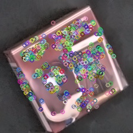

# product-recognition
Author: Sérgio Ricardo G. B. Filho  
NUSP: 10408386

### Project Goal
---------
The goal of this project is to recognize supermarket products in images or, more specifically, every product of a supermarket as individual products in images of the checkout conveyor belt. The model created will be able to generate representations for new products(not present in the training base) in order to recognize them. The idea is that after an unknown product appears a labeled representation is stored and when this product appears for the fourth time the program will be able to recognize it using only the three previous representations.  
  
### Input Images
---------
The images were provided by the gryfo company.  
Each image contains a close up of a single product in a specific orientation. That way each product can be represented by a set of images showing different faces and rotations. See the example below for cherry gelatin.

  
  
  
  

  

### Steps
---------
In order to achieve the goal a computer vision approach for feature descriptions extraction was used.  
Before extracting the features a preprocessing step is performed to improve the contrast in the image. For this step, a clahe filter is applied.

  
  

Notice that the use of clahe added more noise to the image so, to avoid extracting noise as features later on(example below), a denoise step is required.

  
  

To perform the feature extraction step the ORB algorithm was chosen as it has proven to be as efficient as SIFT but faster and free for commercial use. Below are the results for the cherry gelatin example. In the image on the left without preprocessing 796 features were extracted whereas in the image on the right, after the preprocessing steps, 1119 features were extracted.	

  
  

  
 
The bag of features technique was used for the recognition of the products. Tests were made using both the classic model and models combined with ML approaches.
So, after the features were extracted, a k-means clustering was applyed to give the dictionary of visual words. With that in hands, a histogram of visual words(descriptors) was obtained for each image in the training base.
ADD SAMPLE IMAGE
Three different methods were used to recognize products:
    bla
### Results
---------
A Brute Force method was used to compare the different images of the product and match the 30 most similar features. Notice that the greater the transformation of the image, the greater the number of wrong matches.

  
  
  
  

  

